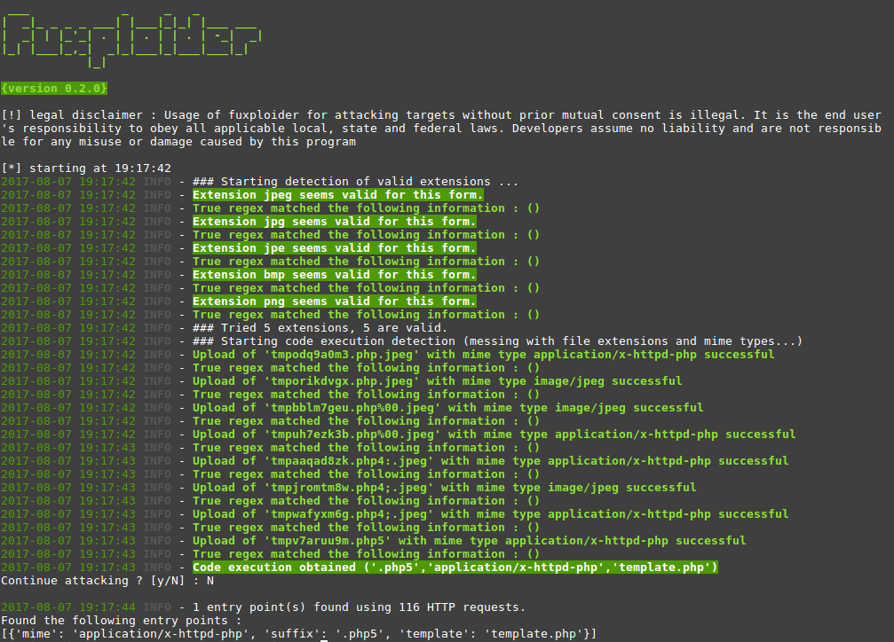

# fuxploider

 

Fuxploider is an open source penetration testing tool that automates the process of detecting and exploiting file upload forms flaws. This tool is able to detect the file types allowed to be uploaded and is able to detect which technique will work best to upload web shells or any malicious file on the desired web server.

Screenshots
----

Installation
----

    git clone https://github.com/almandin/fuxploider.git
    cd fuxploider
    pip3 install -r requirements.txt

For Docker installation

    # Build the docker image
    docker build -t almandin/fuxploider .

Usage
----

To get a list of basic options and switches use :

    python3 fuxploider.py -h

Basic example :

    python3 fuxploider.py --url https://awesomeFileUploadService.com --not-regex "wrong file type"

Special thanks to : **madhatter37**

> [!] legal disclaimer : Usage of fuxploider for attacking targets without prior mutual consent is illegal. It is the end user's responsibility to obey all applicable local, state and federal laws. Developers assume no liability and are not responsible for any misuse or damage caused by this program
